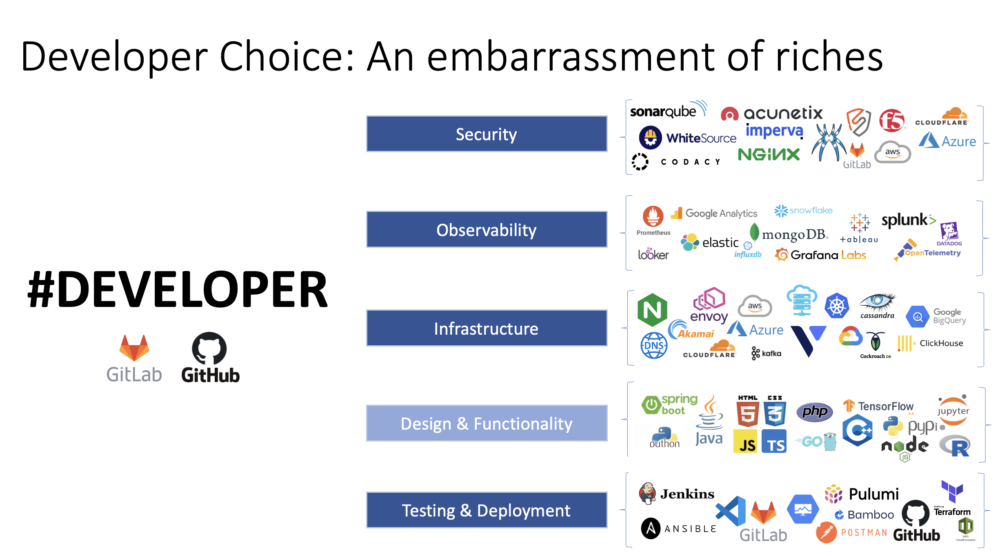

# So, You Want to Share a Cloud Application?

by [Brian DeGeeter](https://github.com/bdegeeter) and [Steven Gettys](https://github.com/sgettys)

We've all been there. You've done all the work to create a GitHub repo with the code needed to show off some cool new cloud application architecture. We all know there's never one tool to rule them all. It's a bit of Terraform, a healthy dose of Ansible, and of course some Bash to connect it all together.

You've done your homework and tested everything out. Deployed it countless times from your laptop. Then you get it out there for others to see. You're waiting to get that feedback from someone asking about the solution or comment about how it solves their problem. But that's not what you hear first. Instead, it's, "I'm getting a Terraform error, can you help me troubleshoot?"

It's always something simple. The terraform code did not declare a specific version for compatibility with the user's version or the wrong version of python is installed for the Ansible role. At the end of the day, it becomes the gap between that first experience you were hoping someone would have and an environmental issue.

This is where [Porter](https://getporter.org/) and [CNAB](https://cnab.io/) bundles come into play. Don't worry this is not about replacing the arduous work you've already done. It's about packaging it such that it's easier for you to maintain and for your users to engage. No more having to worry about the environment your DevOps code runs in. [Porter](https://getporter.org/) provides an opinionated workflow for packaging a versioned instance of your cloud deployment

No more confusion for your users as well. The same [Porter](https://getporter.org/) command line tool used by a maintainer for ownership of a cloud deployment is used to deploy. Your users can install your cloud architecture with just a reference to a versioned OC (docker) container image.

No need to worry about tool dependencies, just run:

```
porter install reference github.com/bdegeeter/JoyOfNginx/Nginx-OSS:v0.1.0
```

Now you'll end up right where the bundle maintainer expects you to be.

## What is a Cloud Native Application?

At its heart, a cloud native application is one expected to be deployed via code. This can be on any of the well-known public clouds (Azure, AWS, GCP, etc.). It also encompasses private cloud platforms like an on prem VMware cluster.

Depending on one's needs this can be the deployment of a SaaS workload on a pre-existing cloud Kubernetes instance. However, it can also encompass a full stack platform with an opinionated deployment of compute, networking, storage, IAM, and more. And while we are talking specifically about cloud native, Porter can really help with anything that could be fully automated and run in a Docker container

## What is CNAB/Porter?

### CNAB

A [Cloud Native Application Bundle (CNAB)](https://cnab.io/) specification for packaging and distributing cloud native applications. It is designed to be an open, portable, and secure way to distribute cloud native applications and their dependencies.

CNAB bundles are composed of several components, including:
* A manifest file that describes the contents of the bundle, including the application and its dependencies.
* The application itself, which can be packaged as a container image or a collection of files
* Dependencies of the application, which can also be packaged as container images or collections of files.
* Installation instructions, which are used to deploy the application and its dependencies to a cloud platform.

One of the key benefits of CNAB bundles is that they provide a single, portable package for distributing cloud native applications. This makes it easier for developers to deploy their applications to different cloud platforms, as the application and its dependencies are all contained within the CNAB bundle.

CNAB bundles also have built-in security features, such as cryptographic signing and verification, to ensure the integrity and authenticity of the bundle. This helps to prevent tampering or modification of the bundle during the distribution process

In addition, CNAB bundles are designed to be extensible, allowing developers to add custom metadata and functionality to their bundles. This enables developers to include additional information and instructions that are specific to their applications, such as configuration settings or post-installation steps.

Overall, CNAB bundles provide a flexible and secure way to distribute cloud native applications, making it easier for developers to deploy and manage their applications across different cloud platforms.

### Porter

Porter is a [CNCF project](https://landscape.cncf.io/?selected=porter) implementing the [CNAB](https://cnab.io/) specification. It provides a CLI and [Kubernetes Operator](https://github.com/getporter/operator) to create, publish, install, and maintain CNABs. Porter provides a consistent, platform-agnostic way to deploy and manage cloud native applications, making it easier to automate and manage the lifecycle of your applications.

## Problems Facing Modern Cloud Solution

### Embarrassment of Riches

There has been an explosion of choices in tooling all with the same goal in mind, automate the deployment of your cloud architecture with an application solution. CNAB bundles provide a common interface for any arbitrary Infrastructure as Code (IaC) tooling.



A CNAB Bundle not only contains your IaC, but also the runtime environment for execution. From a user's perspective it doesn't matter what tools are needed. The bundle publisher selects the best choice and doesn't need to worry about what's installed on the bundle installer's system

### Simplify and Speed Up Deployments

It's possible to do some interesting things via bundles. We're all aware of the problems of "eventually consistent" cloud deployments. While your cloud provider may be still provisioning your Kubernetes cluster, your DevOps code is ready to deploy a workload on top! Within the steps of a bundle, it can wait for conditions to be met before proceeding. Need that Kubernetes system service to be up or Custom Resource Definition (CRD) loaded before deploying a workload on top? A bundle maintainer can account for it in the deployment.

Porter can also accommodate more advanced use cases by allowing a bundle to be made up of other bundles. Do you need the same solution for different cloud providers? Create bundles such that a base for the provider has the same outputs needed to layer your solution on top. Then create a wrapper bundle for a one step deploy to a specific provider.

## Why should I care?

Isn't this just another DevOps tool in a world already saturated with them? Why would I want to spend the time learning about a whole new ecosystem when what I really need is to get solutions out to customers?

Well, I'm glad you asked!

### Accelerating Solution Adoption

The best application is only as good as its ability to be deployed and installed. No matter how useful or innovative your application is, if it is difficult to deploy and run then that can prevent it from ever seeing the light of day.

Let's take a couple of concrete examples:

#### JoyOfNGINX

Check out the [JoyOfNGINX](https://github.com/bdegeeter/JoyOfNGINX/tree/main/porter/nginx-oss) Repo. This is a great collection of automated components that will deploy the necessary infrastructure and provision an NGINX deployment.

The installation process is simple and straightforward with only a few requirements:

* Microsoft Azure account for deploying the infrastructure into,
* Latest version of Terraform that will be used to create the Azure infrastructure,
* Latest version of Ansible that will be used to provision the Azure infrastructure with NGINX,
* An OS that can run Bash to tie Terraform and Ansible together nicely.

The workflow to deploy depends on the user having enough knowledge about Terraform and Ansible to run them locally, as well as following multiple steps in the different subdirectories. Each additional tool and step adds another contact point that can quickly lead to an error.

Additionally, what the "latest version" of a tool means today is something completely different than what it might mean in six months or a year. Tooling updates break backwards compatibility or introduces new assumptions all the time. This can be alleviated by aggressively locking down tooling versions or dependencies but can only be taken as far as the tool or a process supports.

Enter CNAB and Porter.

A [Porter bundle](https://getporter.org/docs/quickstart/bundles/) can be created that holds all tooling versions, scripts, local files, and dependencies.

This reduces the steps required to install the application to two:
1. Setup the Porter Credential Set with the necessary Azure Service Principal credentials
1. Run porter install.

No more managing local versions of Terraform and Ansible or requiring that this runs on a system with a particular version of Bash. No more worrying about future versions of tools not being compatible with the code in the repo. No more "runs on my machine" because everything needed to install the application exists inside of the published and versioned Porter bundle!

Every single run of the application will always use the same versions and the application can be installed without ever cloning a git repo or installing more tools locally. This greatly reduces the number of potential errors a user will run into while installing an application, and fully automates the entire application lifecycle management.

#### NGINX Unit on KinD (Kubernetes in Docker)

The [NGINX Unit Demo](https://github.com/bdegeeter/demo-nginx-unit) bundle shows a different way to use a bundle. Instead of deploying a production solution in the cloud this bundle creates a [KinD Kubernetes](https://kind.sigs.k8s.io/) cluster on the user's system and installs a local example of [NGINX Unit](https://github.com/nginx/unit) running on k85 with ingress configured. It takes advantage of Porter's ability to support bundles that need access to the local docker host.

The bundle definition file sets docker as a requirement which translates to the end user needing to set the `--allow-docker-host-access` command line flag explicitly when installing.

#### Porter Argo Demo

Really want to dive deep? Check out the [Porter Argo Demo](https://github.com/bdegeeter/porter-argo-demo). This repo has everything you need to run the [Porter Operator](https://porter.sh/docs/operator/) with [Argo Workflows](https://argoproj.github.io/argo-workflows/) to see the operator in action with [Jaeger](https://www.jaegertracing.io/) and [OpenTelemery](https://opentelemetry.io/) for observability 

It's important to take away that Porter and CNAB bundles don't replace how your automation works. Instead, it provides a powerful workflow for maintaining and sharing your work for all kinds of use cases.

### Security and Reliability

There are many benefits Porter can provide when creating cloud-native applications:
* Bake security best practices directly into the bundle. Add an auditable stage to your secure supply chain knowing that there were no shortcuts taken when a particular version of an application bundle was deployed!
* Since all aspects of the application are included in the bundle there is a high level of confidence that the application will install the same way every single time.
* Air-gapped installations provide higher security and the ability to know exactly what will be installed every time. A bundle can be developed and approved by a security team and then installed with confidence knowing that versions of packages and libraries will not be inadvertently updated at runtime.
* Bundles can be combined into a single bundle allowing for a more reliable delivery of the full application platform.

## The Value of Porter

Let's contrast the work necessary to get the same value the porter workflow provides.
* Do you ask users to clone a repo and manually run a set of instructions?
* Do you provide a custom internal script to connect a bunch of DevOps solutions together?
* Do you maintain a container with all the tools necessary to run your DevOps code?

| Use Case | Internal Tooling | Porter | Porter Value |
|----------|------------------|--------|--------------|
| The same version of Terraform, Ansible, Python, Salt, Puppet, Node, etc., is used by everyone to deploy: | Readme with details of what user must install or maintain a container with everything needed. | The definition of the container runtime environment is with the DevOps code. It includes best practice workflow for common DevOps technologies. | Less maintenance overhead. As your application changes the runtime for executing follows. |
| Different versions of the application can be deployed reliably every time: | It's up to the team owning the workflow to develop a process to keep things in sync. That can be custom internal tools or just documentation. | Porter's build and publish workflow requires semantic versioning. Docker registry 2.0 supports metadata to link runtime image to code image. | It's one step for user to reference an image tag. That tag has references to the runtime image. Less to keep in sync for maintainers and less work for users. |
| Consistent application lifecycle management independent of DevOps technology: | Keep multiple project's documentation or internal scripts up to date and consistent. | One command CLI interface independent of the DevOps tooling under the hood. | Your users just need to know a single tool and workflow. |
| Ensure best practices for secret/credentials injection: | Another internal process that must be maintained by one or more teams. | Porter by design abstracts inputs and credentials. Namespaces provide access to different secret stores at runtime. | Takes all your existing application code and provides a better security model around it quickly. |
| Workflow with community support and contributions: | Maintaining many custom internal tools that can vary between teams and orgs. | [Mixins](https://getporter.org/docs/introduction/concepts-and-components/intro-mixins/), CNCF supported, slack support. Not a custom internal tool. | Align on common practices that leverage the DevOps code you already have. |

### Call to Action

We all know what it's like to be in the trenches with all your focus on automating deployments. The pressures of release cycles. When does one find time to learn a new tool or technology that perhaps could help? As one who's been there for many years and watched the landscape change, this is one of those times to stop, take a pause, and take a new technology for a test drive. Porter and CNAB are not about replacing the hard work you've done over the years. They're about improving the workflow around it. Maybe you have great security and maintenance practices in place already. If so, Porter's ready for you. Maybe this is something that's still on your to-do list? If so, Porter's ready to take some of the weight of that work off your shoulders.

Try out some of the examples presented here. Reach out to us in the [Porter community](https://getporter.org/community/).
